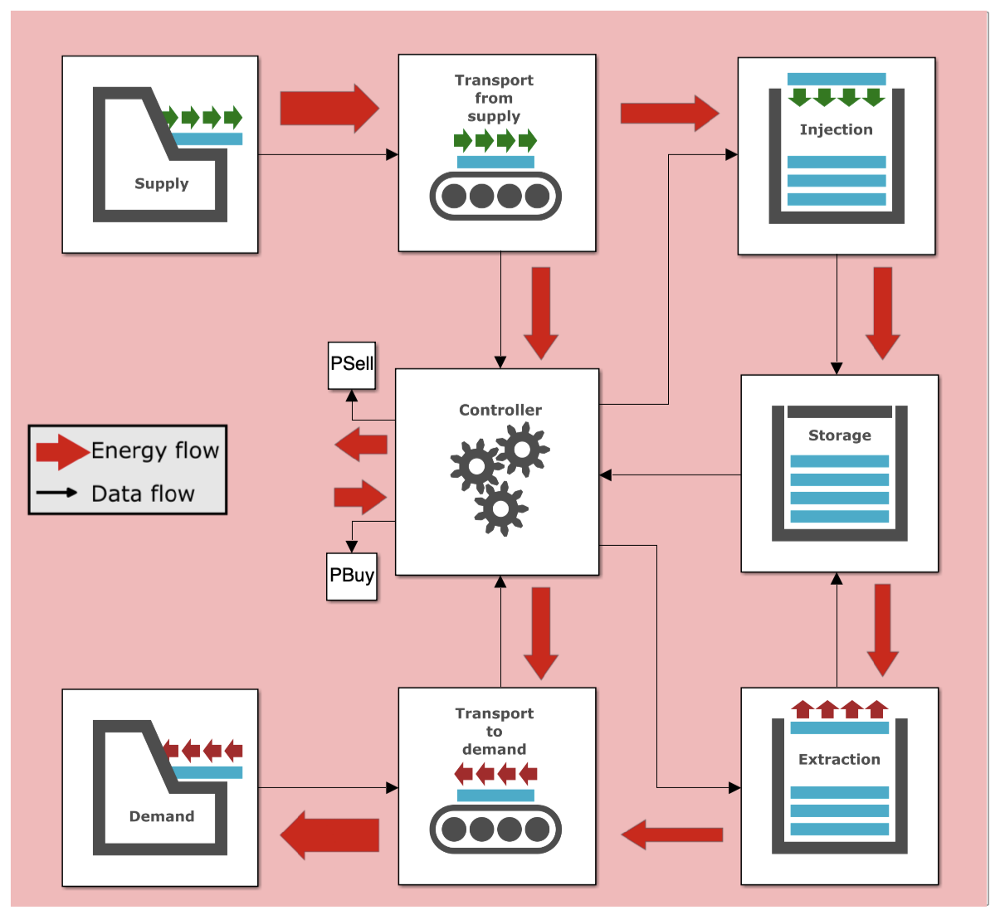

# EST-model
This project contains *Simulink model* for group 37. It models a system where electricity is generated in a solar farm in Sahara desert and demand comes from the city of Cairo. Some of excess energy is stored in a thermal battery.

The termal battery functions by having 2 storage tanks with molten salt - hot and cold. The hot tank stores molten salt at 500℃, whereas cold tank stores it at 300℃. To charge the battery, cold salt is heated and pumped into the tank with hot salt. To discharge the battery, the hot salt is cooled and moved into the cold tank.

This model was used to optimise the mass of molten salt that we use for storing energy. The README.md file will detail how to run the Simulation and will describe the calculations being made under the hood.

## How to run the model?
Clone the entire repository (under `<> Code`) into matlab and open [EST.slx](EST.slx). Hit green button run to launch the simulation.

## How to change the simulation?
All surface-level changes can be made by modifying variables in the [preprocessing.m](preprocessing.m) file, which defines model parameters. To implement bigger changes, it is necessary to modify the code under the Simulink blocks. Next, the structure of the model is explained, which is useful to know for changing the simulation.

## Structure of the model

### Supply & Demand blocks
The supply and demand blocks take data from storage files and tell the generated / demanded power at any given time. Supply and demand files are defined in [preprocessing.m](preprocessing.m).

### Supply & Demand transport blocks
These blocks calculate the power lost in energy transport. Then, they add this lost power to the supplied \ demanded power so that controller would supply more power. The power loss is calculated using formula below.

$$P_{loss}=\frac{R*P_{transport}^2}{U_{transport}^2}$$

### Controller block
Goal of the controller block is to use the supply generated in order to satisfy the demand. In cases when supply isn’t sufficient, controller can either extract power from the storage or, if storage is empty, buy electricity. Similarly, if supply is larger than demand controller can either inject electricity into storage or sell the excess amount.

### Injection block
Injection block receives the injected power from controller and calculates the power that will reach supply after considering the heat exchanger inefficiency.

### Extraction block
Extraction block receives the amount of power that should be obtained from the storage. Since extraction process comes with great losses, the extraction block calculates how much more energy should be removed from the storage.

In practice, extraction happens by using a steam or $$CO_2$$ generator to convert heat into electricity. In these calculations three inefficiencies are considered: turbine, generator and carnot.

### Storage block
This block receives the power that is being injected and extracted from the storage. Additionally, it calculates the heat loss using Newton’s cooling law. Based on this information it calculates the amount of hot salt mass that is needed for storing the required energy in the storage.

